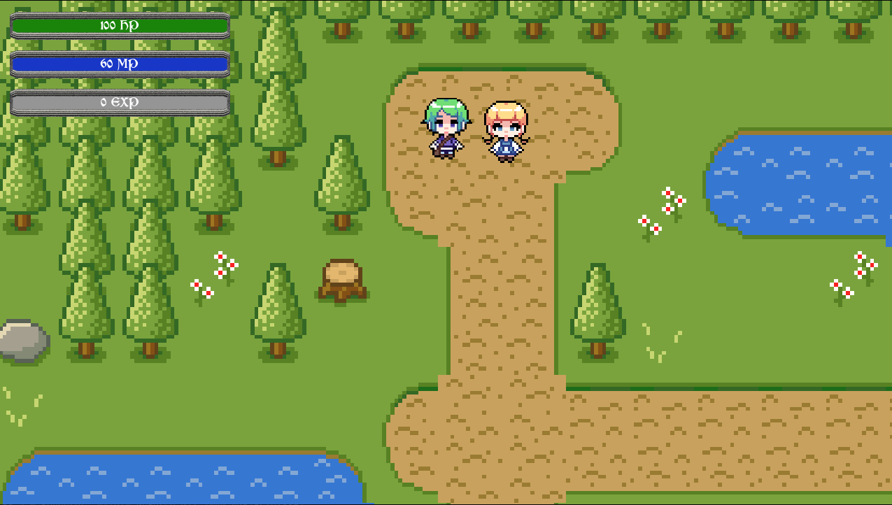

# RPG game in Godot Engine

This is a project for a RPG maker style game that I am making
right now, in order to learn more about the Godot Engine

Objectives:

- [x] Setup
- [x] Importing assets
- [x] AutoTiles
- [x] AutoTiles Snapping
- [x] Player and Movement
- [x] Animated Movement
- [x] Camera Customization
- [x] Invisible barricades
- [x] Action Based System
- [x] Weapon Hit Detection
- [x] Detection Tweaks
- [x] NPCs
- [x] NPC Interaction
- [x] Dialog Part
- [x] Player Stats
- [x] Stats bars
- [x] Pause Menu
- [x] Projectiles
- [] Enemy 
- [] Game Over
- [] Quests
- [] Custom Cursor
- [] Experience System
- [] Inventory
- [] Saving and Loading inventory
- [] File encryption
- [] Currency
- [] Stat display
- [] Add Equipment
- [] Equipping Items/Unequipping Items
- [] More Saving and Loading
- [] Audio Settings
- [] Display Settings
- [] Main Menu
- [] Audio